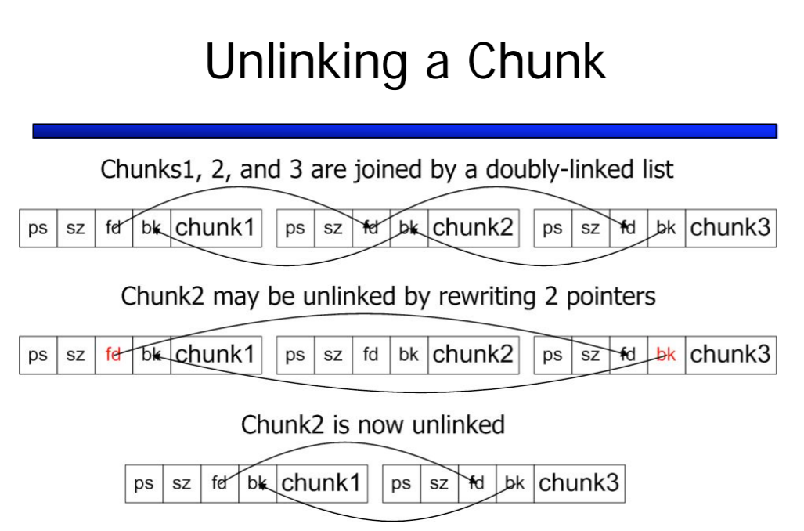
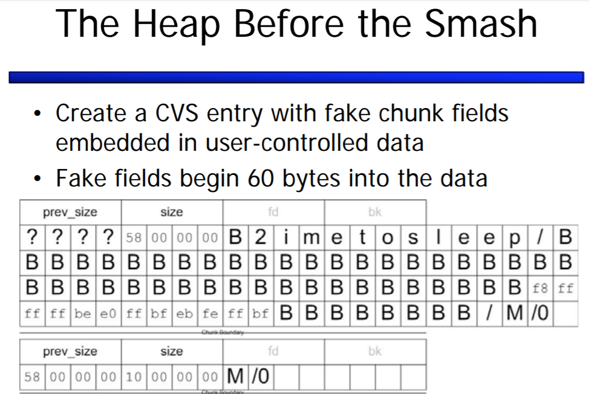
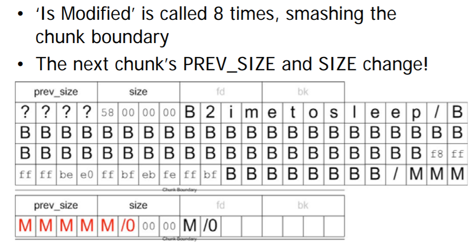
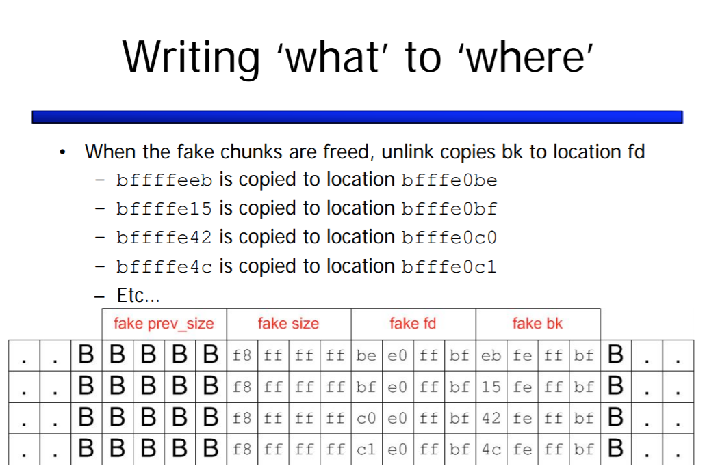
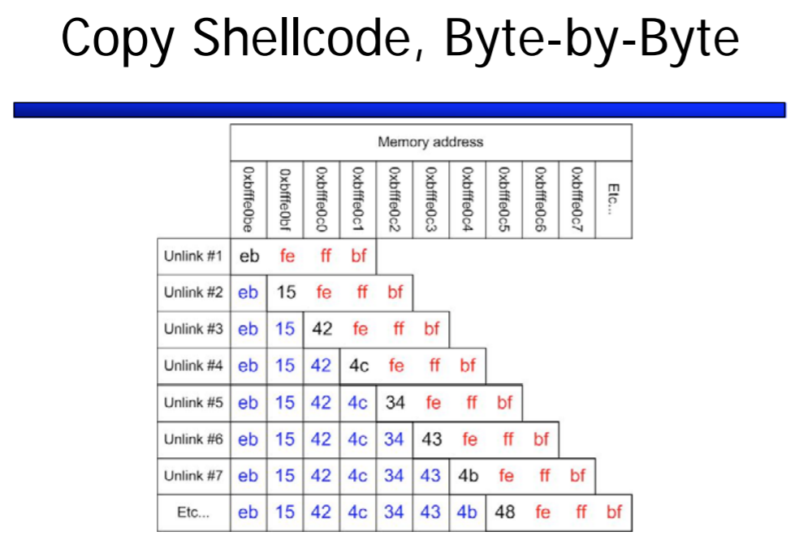

# 9/17 (part 1) Heap Corruption

**Heap:** Stores dynamically allocated memory / objects
**Memory Allocators:** Memory manager is responsible for memory allocation. Functions used to do so *malloc(),calloc(),new() etc.*
Default allocator that is packaged with most OS is *glibc*, OS is responsible for Block memory allocation while memory allocator is responsible for Chunk memory allocation.

**Off by 1:** Heap has no return pointer like stack but has meta-data. Heap is divided into many memory chunks as per user request. Meta-data is used to identify if a linked memory chunk is allocated or unallocated.

### Refering to CVS case
Attacker in this scenario would be any user of the application.
The "Is Modified" command caused the letter "M" to be appended at the end of the CVS entry. Repeatedly calling this funcion would allow the attacker to add addtional 'M' and thus overflow the heap chunk to next allocated chunk.

**Heap Layout**

Each chunk has meta-data / management fields that reside at the boundary. An **allocated** chunk has *Prev_Size* (indicates size of previous chunk) and *Size* (indicates size of current chunk) whereas an **unallocated** chunk will have additional fields - Backward pointer *bd* and forward pointer *fd*. *Prev_Size* and *Size* are of 4 Bytes excluding the LSB of the *Size*.

An ***Unlink*** operation occurs to break an unallocated chunk from linked list and allocate it to the request.

This Unlinking fuction can be viwed as writing "What" to "Where", in this way by overwriting 4 bytes of heap, attacker introduces bytes of shellcode. This part describes the *code injection*.

Similar to stack-smashing, null / return bytes interfere with the attack and may break the flow. Jump (*JMP*) instructions can be used to avoid such situations.

As seen, the "Is Modified" funtion overwrites the *Size* of the next chunk. This overwrites the 0x10 (16 bytes) held originally to "M". The ASCII value of capital 'M' is 77 (0100110**1** in binary). The LSB of *Size* represents the chunk's allocation. LSB 1 indicates previous chunk as allocated. As this bit contributes no significance to the *Size* value, consider it as 0 (0100110**0**) = 76 bytes ! Which allows 60 byte jump to a location that attacker controls.

Making the use of "What" to "Where", the attacker now has to point the location of **return pointer** of stack to point the start address of the shell code.

# (part 2) Code Injection & Mitigation

### Google Project Zero

Google Project zero says:
>The “usefulness" of a given memory corruption vulnerability is determined by how reliably it might be exploited.

Reliability refers to:
>- Does the code cause program to crash during exploitation ?
>- Can the exploit run without being detected ?
>- Does the exploit work in presence of antivirus and does it perform consitently across multiple patch levels ?
>- Is it guaranteed to succeed against a specific version and environment ?

Refer to the blog for different classifications of bug:
https://googleprojectzero.blogspot.com/2015/06/what-is-good-memory-corruption.html

Referring to the concept of **Stack Canary** used to prevent stack overflow and relating it to the heap corruption vulnerability, we can see that the implementation of stack canary would fail as the return pointer is directly overwritten bypassing the canary.

### Mitigations
**Stack Based:**
1. Stack Canary (has limitations)
2. local variable randomization (makes calculation of the attack point less predictable)

**Heap Overflow**
- Randomization
  - Location
  - Selection of chunk
